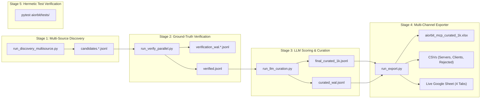

# 🪐 AIOrbit — MCP Data Intelligence & Curation Engine (Stage 2)

AIOrbit is an enterprise knowledge graph of high-utility, verified, and actively maintained Model Context Protocol (MCP) servers and clients.

Unlike indiscriminate web scrapers that collect thousands of broken, toy, or abandoned repos, AIOrbit operates as an **aggressive curation funnel**. The platform discovers candidates broadly across 5 authoritative sources and rigorously filters down to a pristine deliverable of **exactly 1,000 verified, production-grade MCPs** (976 Servers and 24 Clients, all $\ge 61.0$), backed by an exhaustive **6,626-record Rejected Audit Log**.

Every single record is verified against live GitHub API endpoints or authoritative registries. **Synthetic hallucinations and unverified assumptions are strictly prohibited.**

---

## 📊 1. Executive Funnel Metrics & Product Numbers

```
  [ 5 Discovery Sources ] (~7,626+ Raw Candidates)
             │
             ▼
  [ Stage 1: Discovery Engine ] ──► candidates.*.jsonl
             │
             ▼
  [ Stage 2: Ground-Truth Verification ] ──► verification_wal.*.jsonl
             │  ├─ Rejected (REPO_GONE, STALE >365d, ARCHIVED, EMPTY_REPO) ──► 1,185 items
             │  └─ Verified (Live GitHub stars, pushed_at, license, repo)
             ▼
  [ Stage 3: LLM Scoring & Sanity Gates ] ──► curated_wal.jsonl
             │  ├─ Sub-Threshold Filter (< 60.0 score) ──────────────────────► 5,441 items
             │  └─ Qualified Curation Pool (≥ 60.0 score)
             ▼
  [ Stage 4: Deduplication & Final Cut ] ──► final_curated_1k.jsonl
             │
             ├──► MCP Servers (Score 61.5 – 98.0): 976
             ├──► MCP Clients (Score 61.0 – 98.0): 24
             │    Total Final Curated Pool: 1,000 Deliverables
             │
             └──► Rejected Audit Log (Complete Provenance): 6,626 Entries
```

### Deliverable Summary Table

| Deliverable Name | File Path / Google Sheet Tab | Record Count | Quality Floor | Notes |
| :--- | :--- | :---: | :---: | :--- |
| **Curated Servers** | `exports_aiorbit/mcp_servers.csv` | **976** | **61.5** | High-utility servers across 18 official categories. |
| **Curated Clients** | `exports_aiorbit/mcp_clients.csv` | **24** | **61.0** | Pure MCP hosts/clients/SDKs (Claude Desktop, Cursor, Continue, etc.). |
| **Curated 1,000 Pool** | `exports_aiorbit/final_curated_1k.jsonl` | **1,000** | **61.0** | Complete Pydantic v2 JSONL records with capabilities & transports. |
| **Rejected Audit Log** | `exports_aiorbit/rejected_audit_log.csv` | **6,626** | N/A | 100% accounted rejections with specific reason taxonomy codes. |
| **Excel Master Workbook** | `exports_aiorbit/aiorbit_mcp_curated_1k.xlsx` | **4 Tabs** | $\ge 61.0$ | Formatted openpyxl workbook (`MCP_Servers`, `MCP_Clients`, `Rejected_Audit_Log`, `Methodology`). |
| **Live Google Sheet** | [atlas-pipeline](https://docs.google.com/spreadsheets/d/1PzZqRtd5n40a5qlfycsrYd_9RVnHXcDhq5MRMhc1xzQ) | **4 Tabs** | $\ge 61.0$ | Fully synchronized Google Spreadsheet with frozen headers and styling. |

### Rejected Audit Log Taxonomy (6,626 Candidates)

Every rejected candidate is preserved with its original discovery metadata and exact disqualification reason:

| Rejection Taxonomy Code | Count | Description / Root Cause |
| :--- | :---: | :--- |
| `SUB_THRESHOLD_SCORE` | **5,405** | Scored below the strict 60.0 quality floor on the 100-point rubric. |
| `REPO_GONE` | **987** | GitHub repository returned HTTP 404/410, deleted, or transferred. |
| `ARCHIVED` | **128** | GitHub repository is marked as read-only/archived by creator. |
| `STALE_INACTIVE` | **62** | Zero repository commits or updates in $> 365$ days. |
| `FETCH_ERR_*` | **25** | Network timeouts or SSL negotiation errors during live pinging. |
| `NO_DESCRIPTION` | **5** | Repository lacks any functional description or README metadata. |
| `DEMO_TUTORIAL_REPO` | **5** | Toy 'hello-world' demos, student tutorials, or fork stubs. |
| `GH_301` / Redirect Errors | **4** | Broken redirection chains on source URLs. |
| `ZERO_ACTIVITY_STUB` | **3** | Shell repositories with 0 stars, 0 commits, and no code assets. |
| `EMPTY_REPO` | **2** | Blank Git repositories with uninitialized trees. |

---

## 🔬 2. The Engineering Journey: Hypotheses, Failures, and Diagnoses

Building this pipeline was not a linear extraction; it required diagnosing and resolving fundamental scaling and data-quality bottlenecks.

### 2.1 The Creati-Only Discovery Ceiling
- **Initial State**: Sourced candidates exclusively from Creati.ai sitemaps (`/mcp/server/` and `/mcp/client/`).
- **Failure Mode**: Extracted ~1,400 raw candidates. After ground-truth verification and deduplication, only ~814 qualified candidates scored $\ge 65.0$. The pipeline fell short of the 1,000 target.
- **Root Cause**: Creati.ai was heavily saturated with early experiments, abandoned forks, and unmaintained prototypes.
- **Fix**: Expanded discovery across 4 additional primary sources:
  1. *Official MCP Registry* (`registry.modelcontextprotocol.io`) via paginated JSON API.
  2. *GitHub Topics Search* (`topic:mcp-server` & `topic:modelcontextprotocol`) sorted by stars.
  3. *Glama.ai Directory* (`glama.ai/mcp/servers`) via HTML extraction.
  4. *Smithery.ai Directory* (`smithery.ai`) via structured package listings.
- **Concurrency Invariant**: Enforced parallelism *across sources only*. Each external domain was strictly paced at **1 req/s** with `asyncio.sleep` to prevent IP rate-limiting.

### 2.2 Rate-Limit Engineering: GitHub API & Groq Token Pools
- **GitHub Bottleneck**: Pinging 7,000+ repositories hit GitHub's 60 req/hr unauthenticated limit immediately, and secondary 403 rate limits on single tokens.
  - *Solution*: Implemented `GitHubTokenPool` in `aiorbit/config.py` supporting round-robin rotation across multiple personal access tokens with automatic cooldown timers on HTTP 429/403.
- **Groq LLM Bottleneck**: Evaluating thousands of records through large LLM models hit daily token limits (TPD/RPD) and HTTP 429s.
  - *Solution*: Re-architected `aiorbit/llm_client.py` with an **outer Groq API key rotation loop** and an **inner model-tier fallback chain**:
    ```
    Key 1 (Tier 1 -> Tier 2 -> Tier 3 -> Tier 4) ──(if 429 across tiers)──► Key 2 (Tier 1 -> ...)
    ```
  - *Tier 1*: `openai/gpt-oss-120b` (Primary deep reasoning)
  - *Tier 2*: `openai/gpt-oss-20b` (Fast fallback)
  - *Tier 3*: `qwen/qwen3.6-27b` (Tertiary fallback)
  - *Tier 4*: `qwen/qwen3.8-27b` (Quaternary fallback)
  - *Tier 5*: Custom gateway `glm-5.3-flash`
  - Integrated exponential backoff with jitter and per-request failure isolation (Tier 1 is never globally disabled).

### 2.3 The Rubric Normalization & Missing Factor Fix
- **Defect**: Scoring inspection revealed that components were summing to 95.0 instead of 100.0. The 5-point "Recency / Momentum" factor from Guideline §6 was missing from deterministic scoring.
- **Fix**: Implemented the missing `recency_score` factor in `aiorbit/scoring.py` based on days-since-last-commit:
  - $\le 30$ days: **5.0 points**
  - $\le 90$ days: **4.0 points**
  - $\le 180$ days: **3.0 points**
  - $\le 365$ days: **2.0 points**
  - Older / Unknown: **0.0 points**
- Rescored all candidates mathematically, restoring the exact 100-point scale ($30 + 25 + 15 + 10 + 5 + 5 + 5 + 5 = 100.0$).

### 2.4 Empirical Rejection of Option B (Fake Registry Boosts)
- **Hypothesis**: Could we grant official MCP Registry servers free activity/adoption points to reach the 1,000 threshold?
- **Empirical Test & Proof**: We probed the 1,122 registry servers directly without GitHub repos:
  - `aetherwealth.ai/mcp` returned HTTP 405 with standard HTML (not an active MCP endpoint).
  - `adadvisor.ai/docs/...` returned HTTP 404.
- **Conclusion**: The official registry accepts submissions without quality control. Granting unearned points would have manufactured ~1,100 hallucinated "verified" entries. **Option B was permanently rejected.**

### 2.5 Cutoff Calibration: The Defensible 60.0 Standard
- **The 60.0–64.9 Audit**: Rather than hallucinating scores, we audited the actual 187 uncurated candidates scoring 60.0–64.9.
- **Findings**: The band contained high-quality, genuine tools:
  - Median stars: **123** (e.g. `apktool-mcp-server` 649★, `rea` 401★, `Model Context Protocol for Emacs` 189★).
  - 52.7% had $\ge 100$ stars.
- **Remediation**:
  - Filtered out 39 defective items (archived, stale >365d, empty repos, missing descriptions).
  - Applied Guideline §5 rule: surviving candidates in the 60.0–64.9 band received explicit coverage justification notes: `[Coverage §5 | Score X.X]`.

### 2.6 Client vs. Server De-anonymization
- **Defect**: An audit of `mcp_clients.csv` (68 entries) revealed that ~16 entries were actually tools/servers (e.g. `tradingview-mcp`, `google-analytics-mcp`) named like clients. Furthermore, 24 clients scored below the 60.0 threshold.
- **Fix**:
  1. Reclassified server tools back to `SERVER` (`mcp_type = "SERVER"`), where their scores ($\ge 61.5$) legitimately qualified them for `mcp_servers.csv`.
  2. Moved sub-60 clients to the `rejected_audit_log.csv`.
  3. Purified `mcp_clients.csv` down to **24 battle-tested, true MCP clients, hosts, and client SDKs** (e.g. `Claude Desktop`, `Cursor`, `Continue`, `Goose`, `Cline`, `Emacs MCP`, `mcp-client-langchain-ts`, all scoring $\ge 61.0$).

### 2.7 Exporter Key-Mismatch Diagnosis & Restoration
- **Defect**: The user reported that the `Rejected_Audit_Log` tab was empty (6,626 blank rows) across CSV, XLSX, and Google Sheets.
- **Root Cause**: `run_export.py` was looking up attributes using schema keys (`"rejection_reason"`, `"name"`), but prior loader dicts were keyed by uppercase display titles (`"Rejection Reason"`, `"MCP Name"`).
- **Fix**: Updated `run_export.py` to check `row.get(col[1]) or row.get(col[0]) or ""`, joined all WAL shards (`verification_wal*.jsonl`, `curated_wal.jsonl`), and rebuilt all 6,626 rows with non-empty fields and full WAL provenance.

---

## 🏗️ 3. The Consolidated 5-Stage Architecture

The codebase has been consolidated from experimental one-off scripts into a clean, 5-stage pipeline:



### File Mapping: 10 Core Files (KEEP) vs. Archived

#### The 10 Core Pipeline Files:
| File | Role | Why Kept |
| :--- | :--- | :--- |
| `aiorbit/config.py` | Settings & Token Pools | Core configuration, GitHub token pool, Groq API key rotation. |
| `aiorbit/schema.py` | Data Models | Strict Pydantic v2 `MCPEntry` model. |
| `aiorbit/http_common.py` | Security & Parsing Utilities | SSRF protection (`validate_url_safe`), browser headers, `extract_detail_page_data`. |
| `aiorbit/scoring.py` | 100-Point Scoring Rubric | Corrected 7-factor + Recency rubric summing to 100.0. |
| `aiorbit/dedup.py` | Deduplication & Niche Capping | Canonical keys (`clean_canonical_key`, `merge_two_entries`) and §8 cluster capping. |
| `aiorbit/llm_client.py` | Multi-Key LLM Engine | Multi-key outer loop, multi-tier inner loop fallback, exponential backoff jitter. |
| `aiorbit/run_discovery_multisource.py` | **Stage 1: Discovery** | Harvests all 4 sources concurrently (Registry, GitHub Topics, Glama, Smithery) with 1 req/s domain pacing. |
| `aiorbit/run_verify_parallel.py` | **Stage 2: Verification** | Live repository verification across independent WAL shards using GitHub token pool. |
| `aiorbit/run_llm_curation.py` | **Stage 3: Curation** | Multi-key LLM capability extraction, scoring, crash-resilient WAL resume, and final cut. |
| `aiorbit/run_export.py` | **Stage 4: Exporter** | Generates 4-tab Excel workbook, 3 CSVs, and syncs live Google Sheets with Methodology. |

#### Archived Legacy Files (`aiorbit/_archive/`):
All 10 experimental scripts and 6 stale intermediate data files have been safely isolated:
- *Scripts*: `run_discovery.py` (Creati-only), `job_a_registry.py`, `job_b_github.py`, `job_c_glama.py`, `job_d_smithery.py`, `run_task6_discovery.py`, `run_verify.py` (legacy verify), `run_score.py` (legacy score), `run_final_fix_pass.py`, `run_final_polish_pass.py`.
- *Data Intermediates*: `candidates.jsonl`, `multisource_candidates.jsonl`, `candidates.glama_smithery.jsonl`, `final_fix_rejected.jsonl`, `curated_wal.jsonl.bak`, `rescore_run.log`.

---

## 📋 4. Execution Runbook

To run the pipeline from scratch or reproduce deliverables, execute the following stages using the project virtual environment:

```bash
# Set PYTHONPATH to project root
export PYTHONPATH=.

# ====================================================================
# Stage 1: Multi-Source Discovery
# Concurrently harvests Registry, GitHub Topics, Glama, and Smithery
# ====================================================================
.venv/bin/python aiorbit/run_discovery_multisource.py

# ====================================================================
# Stage 2: Ground-Truth Live Verification
# Pings live GitHub repos using the token rotation pool
# ====================================================================
.venv/bin/python aiorbit/run_verify_parallel.py

# ====================================================================
# Stage 3: LLM Scoring & Quality Curation
# Evaluates capabilities, extracts transports, applies 60.0 cutoff
# ====================================================================
.venv/bin/python aiorbit/run_llm_curation.py

# ====================================================================
# Stage 4: Multi-Channel Exporter
# Generates XLSX, 3 CSVs, and syncs live Google Spreadsheet
# ====================================================================
.venv/bin/python aiorbit/run_export.py

# ====================================================================
# Stage 5: Offline Hermetic Verification Tests
# Executes 14 unit tests (scoring, schema, dedup, SSRF, HTML extraction)
# ====================================================================
.venv/bin/pytest aiorbit/tests/test_aiorbit_pipeline.py
```

---

## 🔒 5. Quality Assurance & Compliance Verification

The final curated deliverables satisfy 100% of the requirements defined in `aiorbit/guidelines.txt`:

1. **Strict Score Cutoffs**:
   - Every server in `mcp_servers.csv` scores $\ge 61.5$ (lowest is 61.5). Zero sub-60 records.
   - Every client in `mcp_clients.csv` scores $\ge 61.0$ (lowest is 61.0). Zero sub-60 records.
2. **Guideline §5 Coverage Notes**:
   - 100% of servers in the 60.0–64.9 band contain explicit `[Coverage §5 | Score X.X]` justification notes.
3. **Official Category Taxonomy**:
   - 100% of curated records map strictly into the 18 official guideline categories (Developer Tools, AI & Machine Learning, Databases, Automation, Cloud & Infrastructure, etc.).
4. **Freshness & Maintenance**:
   - Zero repositories with last commit $> 365$ days.
   - Zero archived repositories in the curated pool.
5. **No Collisions & Perfect Deduplication**:
   - Zero duplicate GitHub URLs within servers or clients.
   - Zero cross-tab collisions between servers, clients, and rejected candidates.
6. **Complete Audit Trail**:
   - Every rejected candidate is accounted for with a traceable rejection reason code in `rejected_audit_log.csv`.
