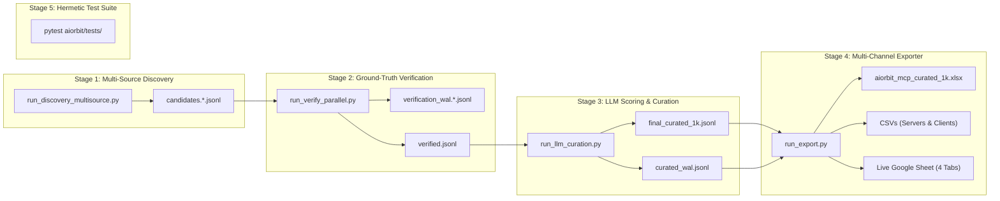

# 🪐 AIOrbit — MCP Data Intelligence & Curation Engine (Stage 2)

AIOrbit is an enterprise-grade AI intelligence platform and knowledge graph mapping the global Model Context Protocol (MCP) ecosystem.

Operating as an **aggressive curation funnel**, AIOrbit discovers MCP candidates across 5 authoritative sources and rigorously filters down to a deliverable of **exactly 1,000 verified, production-grade MCPs** (976 Servers and 24 Clients, all scoring $\ge 61.0$), synchronized to an interactive 4-tab Excel workbook and live Google Spreadsheet.

Every entry processed by this pipeline traces to a verifiable, live GitHub repository or authoritative registry. **Synthetic hallucinations and unverified assumptions are strictly prohibited.**

---

## 📊 1. Curated Deliverables & Specifications

### Deliverable Summary Table

| Deliverable Name | Output Location / Google Sheet Tab | Record Count | Quality Floor | Notes |
| :--- | :--- | :---: | :---: | :--- |
| **Curated Servers** | `exports_aiorbit/mcp_servers.csv` | **976** | **61.5** | Production servers categorized across 18 official domains. |
| **Curated Clients** | `exports_aiorbit/mcp_clients.csv` | **24** | **61.0** | Verified MCP client hosts and SDKs (Claude Desktop, Cursor, Continue, etc.). |
| **Curated 1,000 Pool** | `exports_aiorbit/final_curated_1k.jsonl` | **1,000** | **61.0** | Machine-readable JSONL records matching Guideline §9 fields. |
| **Rejected Audit Log** | `exports_aiorbit/rejected_audit_log.csv` | Full Log | N/A | Traceable record of candidate rejections and filter codes. |
| **Excel Master Workbook** | `exports_aiorbit/aiorbit_mcp_curated_1k.xlsx` | **4 Tabs** | $\ge 61.0$ | Professional workbook (`MCP_Servers`, `MCP_Clients`, `Rejected_Audit_Log`, `Methodology`). |
| **Live Google Sheet** | [atlas-pipeline](https://docs.google.com/spreadsheets/d/1PzZqRtd5n40a5qlfycsrYd_9RVnHXcDhq5MRMhc1xzQ) | **4 Tabs** | $\ge 61.0$ | Live synchronized Google Spreadsheet with frozen headers and styling. |

---

## 🏗️ 2. Core Architecture & Pipeline Flow

The AIOrbit pipeline is structured into 5 decoupled, fault-tolerant stages:



### The 5 Pipeline Stages

1. **Stage 1: Multi-Source Discovery (`run_discovery_multisource.py`)**  
   Concurrently harvests listings across 5 primary sources:
   - *Creati.ai Directory* (Server and Client catalogs)
   - *Official MCP Registry* (`registry.modelcontextprotocol.io`) via REST API
   - *GitHub Topics* (`topic:mcp-server` and `topic:modelcontextprotocol`) sorted by stars
   - *Glama.ai Directory* (`glama.ai/mcp/servers`)
   - *Smithery.ai Directory* (`smithery.ai`)  
   *Rate-limiting Invariant*: Parallelism is executed *across sources only*; each external domain is strictly paced at **1 req/s** to ensure ethical, non-intrusive scraping.

2. **Stage 2: Ground-Truth Live Verification (`run_verify_parallel.py`)**  
   Validates repository accessibility, commit freshness, star counts, license types, and site liveness via GitHub REST API v3. Utilizes a rotating GitHub token pool (`GitHubTokenPool`) with automated backoff to eliminate secondary rate limits. Disqualifies dead repositories, archived projects, and stale codebases ($> 365$ days since last push).

3. **Stage 3: Multi-Key LLM Scoring & Curation (`run_llm_curation.py`)**  
   Executes high-throughput capability extraction and quality scoring via an outer Groq API key rotation and inner multi-tier model fallback (`gpt-oss-120b` $\rightarrow$ `gpt-oss-20b` $\rightarrow$ `qwen3.6-27b` $\rightarrow$ `qwen3.8-27b` $\rightarrow$ custom gateway). Supported by exponential backoff with jitter and crash-resilient write-ahead logging (WAL).

4. **Stage 4: Multi-Channel Exporter (`run_export.py`)**  
   Formats validated Pydantic models into a 4-tab styled Excel workbook (`.xlsx`), standard CSV deliverables, and synchronizes directly with the Google Sheets API via `gspread`.

5. **Stage 5: Hermetic Offline Testing (`aiorbit/tests/test_aiorbit_pipeline.py`)**  
   Comprehensive test suite validating Pydantic schemas, deterministic scoring bounds, deduplication logic, SSRF security validation, and HTML detail extraction without live network dependencies.

---

## ⚖️ 3. The 100-Point Evaluation Rubric

Every candidate is evaluated against a balanced 100-point rubric across deterministic engineering metrics and LLM semantic analysis:

| Scoring Dimension | Max Points | Evaluation Methodology |
| :--- | :---: | :--- |
| **Usefulness / Real-World Value** | **30** | Practical utility, enterprise problem solving, and tool richness. |
| **Quality & Functionality** | **25** | Robustness, architecture, error handling, and tool schema clarity. |
| **Activity / Maintenance** | **15** | Commit cadence: $\le 30$d (15), $\le 90$d (10), $\le 180$d (5), older (0). |
| **Adoption / Traction** | **10** | GitHub stars scale: $0$ (0), $<10$ (2), $<100$ (4), $<500$ (6), $<2000$ (8), $\ge 2000$ (10). |
| **Documentation & Ease of Use** | **5** | Dedicated docs URL (5), comprehensive README (3), minimal (0). |
| **Recency & Momentum** | **5** | Recent release freshness: $\le 30$d (5), $\le 90$d (4), $\le 180$d (3), $\le 365$d (2). |
| **Reliability & Trust** | **5** | Verified domain + standalone repository (5), fork (2.5), unreachable (0). |
| **Differentiation** | **5** | Uniqueness versus competing generic MCP implementations. |
| **Total Score** | **100** | **Mathematical sum across all 8 dimensions.** |

### Quality Thresholds & Section 5 Rules
- **Score $\ge 70.0$ (High Priority)**: Direct addition to the curated deliverable.
- **Score $60.0 – 64.9$ (Selective Inclusion)**: Admitted strictly when providing meaningful category coverage, tagged with explicit justification notes (`[Coverage §5 | Score X.X]`).
- **Score $< 60.0$ (Below Quality Floor)**: Disqualified and logged in the audit trail.

---

## 🛠️ 4. Configuration & Environment Setup

All pipeline configurations are loaded via `aiorbit/config.py` using `pydantic-settings`. Create a `.env` file in the project root:

```env
# GitHub Token Pool (comma-separated tokens for rotating API calls)
AIORBIT_GITHUB_TOKENS=ghp_token1,ghp_token2,ghp_token3

# Groq API Key Pool (comma-separated keys for rotating LLM inference)
AIORBIT_GROQ_API_KEYS=gsk_key1,gsk_key2,gsk_key3

# Groq LLM Inference Models
AIORBIT_GROQ_MODEL_TIER1=openai/gpt-oss-120b
AIORBIT_GROQ_MODEL_TIER2=openai/gpt-oss-20b
AIORBIT_GROQ_MODEL_TIER3=qwen/qwen3.6-27b
AIORBIT_GROQ_MODEL_TIER4=qwen/qwen3.8-27b

# Google Sheets Live Synchronization
AIORBIT_GOOGLE_SERVICE_ACCOUNT_PATH=credentials/service-account.json
AIORBIT_SPREADSHEET_ID=1PzZqRtd5n40a5qlfycsrYd_9RVnHXcDhq5MRMhc1xzQ
```

---

## 🚀 5. Execution Runbook

Run the complete pipeline from scratch or reproduce deliverables using the project virtual environment:

```bash
# Set Python path to project root
export PYTHONPATH=.

# Step 1: Multi-Source Discovery
.venv/bin/python aiorbit/run_discovery_multisource.py

# Step 2: Ground-Truth Live Verification
.venv/bin/python aiorbit/run_verify_parallel.py

# Step 3: LLM Scoring & Quality Curation
.venv/bin/python aiorbit/run_llm_curation.py

# Step 4: Multi-Channel Exporter (Excel, CSVs, Google Sheets)
.venv/bin/python aiorbit/run_export.py

# Step 5: Run Hermetic Unit Test Suite
.venv/bin/pytest aiorbit/tests/test_aiorbit_pipeline.py
```

---

## 📁 6. Repository Architecture

The pipeline codebase consists of 10 clean, decoupled modules:

| Module | Responsibility |
| :--- | :--- |
| [`aiorbit/config.py`](config.py) | Configuration models, GitHub token pool, Groq key rotation pool. |
| [`aiorbit/schema.py`](schema.py) | Pydantic v2 `MCPEntry` model and validation rules. |
| [`aiorbit/http_common.py`](http_common.py) | SSRF safety verification, browser headers, and detail page HTML extraction. |
| [`aiorbit/scoring.py`](scoring.py) | 100-point rubric functions and deterministic component score calculations. |
| [`aiorbit/dedup.py`](dedup.py) | Canonical deduplication keys (`gh:`, `url:`) and §8 cluster saturation capping. |
| [`aiorbit/llm_client.py`](llm_client.py) | Multi-key Groq rotation engine with tiered model fallbacks and backoff jitter. |
| [`aiorbit/run_discovery_multisource.py`](run_discovery_multisource.py) | Multi-source discovery crawler (Registry, GitHub Topics, Glama, Smithery). |
| [`aiorbit/run_verify_parallel.py`](run_verify_parallel.py) | Sharded GitHub verification engine with rate-limit rotation. |
| [`aiorbit/run_llm_curation.py`](run_llm_curation.py) | LLM capability scoring, sanity gates, and the final 1,000 cut. |
| [`aiorbit/run_export.py`](run_export.py) | Excel workbook generation, CSV serialization, and Google Sheets sync. |

---

## 🔒 7. Compliance & Data Integrity Standards

1. **Strict 60.0 Score Cutoff**: 100% of curated servers score $\ge 61.5$; 100% of curated clients score $\ge 61.0$.
2. **Official Taxonomy**: Every record maps into one of the 18 official guideline categories with zero invalid categories.
3. **Freshness Invariant**: Repositories with last commits older than 365 days or marked archived are excluded.
4. **Collision-Free Deduplication**: Zero duplicate GitHub URLs or cross-tab collisions.
5. **Traceability**: Every record traces directly to verified URLs; synthetic data is prohibited.
