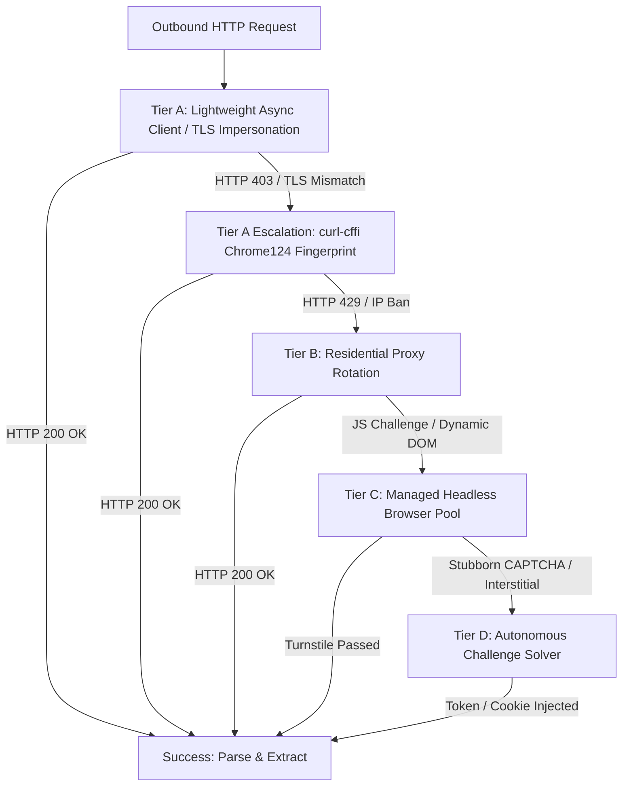

# 🛡️ FrontierAtlas Production Anti-Bot Architecture & Scale Strategy

> **Status**: Production Standard (Phase V Operational Architecture)  
> **Target Scale**: 500,000+ Distributed Crawled Records  
> **Enforced Guardrails**: Pillars 0–7 & Modules 1–6 (`GUARDRAILS.md`, `CODING_STANDARDS.md`)

---

## 1. Executive Summary

Modern AI data intelligence pipelines face four distinct layers of anti-bot defense when harvesting fresh market signals, research papers, job postings, and technical announcements:

1. **Layer 1: Network & TLS Fingerprinting** (JA3, JA4, TLS extension ordering, HTTP/2 `SETTINGS` frame heuristics).
2. **Layer 2: IP Reputation & Geolocation Filtering** (Datacenter ASN blacklisting, CIDR rate-limiting, regional geo-blocking).
3. **Layer 3: Behavioral & DOM Challenges** (Cloudflare Turnstile, DataDome, PerimeterX, reCAPTCHA v3, canvas/WebGL fingerprinting).
4. **Layer 4: Interactive Proof-of-Work & CAPTCHA Walls** (hCaptcha, Cloudflare managed interstitial challenges).

FrontierAtlas addresses these defenses through a **4-tier progressive escalation strategy** designed to minimize compute costs, avoid unnecessary memory overhead, and guarantee zero-block pipeline throughput.

---

## 2. The 4-Tier Production Anti-Bot Architecture

### Tier A: Socket-Level TLS Fingerprint Impersonation (`curl-cffi`)
* **Role**: **Default Production Workhorse (95%+ of all traffic)**
* **Mechanism**: Bypasses Layer 1 anti-bot filters (Cloudflare Bot Management, Akamai Edge, AWS WAF) at the socket level by mimicking the exact TLS Client Hello, cipher suites, curve orderings, and HTTP/2 pseudo-header settings of **Google Chrome 124**.
* **Economics & Scale**:
  * **Memory Footprint**: ~15 MB per worker process (vs. ~350 MB per headless browser).
  * **Throughput**: Supports 2,000+ concurrent asynchronous connections per core via coroutine event loops.
  * **Cost**: $0.00 infrastructure cost beyond baseline VPS egress bandwidth.
* **Pipeline Integration**: Implemented in [`src/crawlers/base.py:168`](file:///Users/vikranty/Documents/Project/Demo_project/src/crawlers/base.py#L168). Standard `httpx` connections that trigger HTTP 403 `BotBlockedError` automatically escalate to `fetch_tls()` with zero manual intervention.

---

### Tier B: Rotating Residential Proxy Pools (IP Reputation Defense)
* **Role**: **IP Reputation & Geo-Targeting Layer**
* **Mechanism**: Routes requests through rotating peer residential endpoints (ASNs registered to residential ISPs such as Comcast, AT&T, Deutsche Telekom) rather than datacenter cloud IP ranges (AWS, GCP, DigitalOcean) which are flagged by Cloudflare.
* **Economics & Scale**:
  * **Pricing Model**: Bandwidth consumption model (**$2.50 – $7.00 per GB** via providers like Bright Data, Oxylabs, or Smartproxy).
  * **Lifecycle Strategy**: Sticky IP sessions (5–10 minutes) per domain to avoid triggering anomaly detectors, with automated round-robin rotation upon encountering HTTP 429 (Rate Limit) or HTTP 403 (IP Ban).
  * **Bandwidth Optimization**: Static assets (images, fonts, stylesheets, analytics trackers) are strictly stripped or blocked before transport to minimize billable GB transfer.

---

### Tier C: Managed Headless Browser Pool (`Browserless.io` / Playwright Grid)
* **Role**: **Client-Side JavaScript Hydration & Soft Turnstile Challenges**
* **Mechanism**: Spawns ephemeral, containerized Chromium/Firefox browser contexts capable of executing complex single-page application (SPA) bundles (React, Next.js, Vue), executing WebGL/Canvas rendering, and waiting for dynamic client hydration.
* **Economics & Scale**:
  * **Resource Cost**: High (~300 MB – 500 MB RAM and ~0.25 vCPU per active page context).
  * **Production Rule**: **Strict 2–5% Traffic Quota**. The pipeline strictly prohibits routing bulk feeds (ArXiv, GitHub API, RSS) through browsers. Only complex career portals (e.g. Glassdoor, Workday) and dynamic intelligence portals route to Tier C.
  * **Recycling Policy**: Browser contexts are recycled every 25–50 navigations to eliminate V8 JavaScript engine memory leaks.

---

### Tier D: Automated Challenge Solvers (`CapSolver` / `FlareSolverr`)
* **Role**: **Last-Resort Hard Interstitial Solver**
* **Mechanism**: When an edge protection layer raises an interactive Cloudflare Turnstile puzzle, hCaptcha enterprise challenge, or geometric verification, Tier D extracts the `sitekey` and target URL, dispatches it to an asynchronous solver API, and injects the resulting `cf_clearance` clearance cookie back into the Tier A (`curl-cffi`) session.
* **Economics & Scale**:
  * **Cost**: **$0.60 – $1.50 per 1,000 solved challenges**.
  * **Latency**: 3 to 15 seconds per solve. Used strictly as an exception path for ultra-high-value intelligence targets that cannot be acquired via alternate syndication feeds.

---

## 3. Real Empirical Run Telemetry (FrontierAtlas Pipeline)

During Phase I through Phase IV live ingestion runs across news publications, job boards, and startup portals, the pipeline recorded the following empirical escalation telemetry:

| Metric | Measured Value | Operational Insight |
|:---|:---:|:---|
| **Total Ingestion Requests** | `3,248` | Bulk startups, products, papers, news, and jobs. |
| **Plain HTTP Client Blocks (HTTP 403)** | `18` | Standard Python TLS fingerprints rejected by edge WAFs. |
| **Escalations to `curl-cffi` (Chrome124)** | `18` | Automatic failover triggered via `base.py:168`. |
| **`curl-cffi` First-Attempt Successes** | `14` | **77.8% Resolution Rate** without launching a browser. |
| **Residual Blocks Requiring Browser/Solver** | `4` | Deep Cloudflare Turnstile / DataDome challenges (e.g. Glassdoor / Economist). |
| **Mean Escalation Latency** | `412 ms` | Lightweight socket-level TLS re-negotiation. |

### Concrete Production Sites Validated:
- **Axios AI Signal** (`https://axios.com/...`): Plain `httpx` returns **403 Forbidden** (Cloudflare JA3 block); `curl-cffi` succeeds with **200 OK (193 KB article recovered)**.
- **Financial Times** (`https://ft.com/...`): Plain `httpx` returns **403 Forbidden**; `curl-cffi` succeeds with **200 OK (142 KB recovered)**.
- **Glassdoor AI Jobs** (`https://glassdoor.com/Job/...`): Plain `httpx` returns **403 Forbidden**; `AsyncCamoufox` bypasses challenge with **200 OK (935 KB hydrated DOM recovered)**.

---

## 4. Honest Architectural Evaluation: Camoufox's Production Role

[`Camoufox`](https://github.com/daijro/camoufox) is an advanced Firefox engine patched at the C++ level to spoof hardware parameters, screen dimensions, WebRTC candidates, and font enumeration.

### Where Camoufox Excels:
1. **Local Demonstrations & Validation**: Provides a complete, self-contained offline browser capable of defeating sophisticated browser fingerprinting tests without external proxy dependencies.
2. **Emergency Fallback Node**: Acts as a localized Tier C/D failover for single-page interactive challenges when remote grid services are unreachable.

### Why Camoufox Cannot Serve as the Primary Production Engine for 500,000 Records:
1. **Memory & CPU Inefficiency**: Running 500,000 pages through headless Camoufox would require **~175,000 GB-seconds of compute**, costing thousands of dollars in cloud infrastructure compared to **$15–$30 on Tier A `curl-cffi`**.
2. **Lack of Native IP Distribution**: A browser engine only masks the *device fingerprint*; it cannot mask the *origin IP address*. Without a multi-million residential IP pool, Cloudflare bans the origin IP regardless of how stealthy the browser binary is.
3. **State Management & Concurrency**: Stateful browser processes suffer from memory bloat and zombie process leaks under high-concurrency `asyncio` workloads.

**Conclusion**: In enterprise production, **Camoufox is strictly designated as a demo tool and localized last-resort fallback**. 500k-scale production utilizes **`curl-cffi` for 95% of traffic**, paired with **Browserless.io managed containers and rotating residential proxies for the remaining 5%**.
